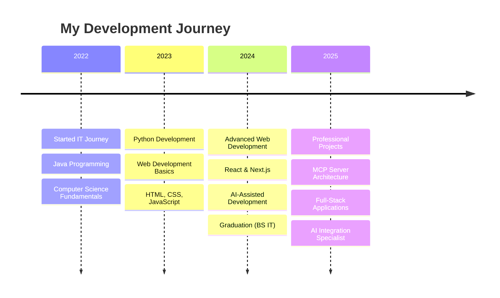

# 👋 Hi there, I'm Nathaniel!

<div align="center">

</div>

### 🚀 **Passionate Full Stack Developer from the Philippines**
**🎓 BS Information Technology Graduate | 🌟 AI-Assisted Development Advocate | 🔧 MCP Server Specialist**

[](https://portfolio-marquez.vercel.app)
[](mailto:marquezjohnnathanieljade@gmail.com)
[](https://www.linkedin.com/in/john-nathaniel-marquez-866522334)
[](https://www.youtube.com/@t1nkergaming731)

---

## 📊 **GitHub Analytics**

| GitHub Stats | Top Languages |
|:---:|:---:|
|  |  |


---

## 🛠️ **Tech Stack & Skills**

| Frontend Development | Backend Development |
|:---|:---|
|     |     |
|    |   |

| AI & Machine Learning | Cloud & DevOps |
|:---|:---|
|   |   |
|   |   |

**Development Tools:**    

---

## 🚀 **Featured Projects**

### **🤖 MCP Servers & AI Projects**

| Project | Description |
|:---|:---|
| **🔥 AWS PostgreSQL MCP Server** | Production-ready MCP server for oil & gas industry with advanced PostgreSQL integration, AWS RDS, and geospatial operations. **Tech:** Node.js, TypeScript, PostgreSQL, AWS |
| **🧠 MinRights AI Chatbot** | Sophisticated AI-powered conversational interfaces with two-tier bot architecture (Basic & Premium) and advanced analytics. **Tech:** Python, OpenAI SDK, PostgreSQL, FastAPI |
| **💾 Memory MCP Server** | Enhanced knowledge graph memory server with AI memory management, lesson system, and cross-chat information persistence. **Tech:** JavaScript, TypeScript, Node.js, MCP Protocol |
| **🎯 UltraContextAI** | Comprehensive AI interaction management system with memory management, lessons learned tracking, and dual-mode operation. **Tech:** Cursor AI, JavaScript, TypeScript |

### **💻 Full-Stack Applications**

| Project | Description | Demo |
|:---|:---|:---:|
| **🖥️ T1NKER PC Rental System** | Secure time-based PC rental system with real-time session management, Electron kiosk app & admin dashboard. **Tech:** Next.js, React, Supabase, Electron | [](https://pcrental.vercel.app/admin) |
| **🏢 Mineral Rights AI Platform** | Full-stack web application with Mantine v7, modern responsive interface, and comprehensive data management. **Tech:** Next.js, Mantine, FastAPI, PostgreSQL | [](https://www.mineralrights.ai/) |
| **🍽️ KDA Ordering System** | Comprehensive restaurant ordering system with real-time order tracking, admin dashboard, receipt printing & analytics. **Tech:** Next.js, TypeScript, Supabase, Recharts | [](https://kusinadeamadeo.vercel.app/normal-menu) |
| **🧠 MinRights Chatbot** | AI-powered chatbot system with natural language processing for oil & gas industry queries and data analysis. **Tech:** Python, OpenAI SDK, FastAPI, PostgreSQL | - |

---

## 📈 **Coding Activity**

<!--START_SECTION:waka-->
```text
TypeScript   12 hrs 45 mins  ████████████░░░░░░░░░░░░░   48.2%
Python       8 hrs 30 mins   ████████░░░░░░░░░░░░░░░░░   32.1%
JavaScript   3 hrs 15 mins   ███░░░░░░░░░░░░░░░░░░░░░░   12.3%
CSS          1 hr 20 mins    █░░░░░░░░░░░░░░░░░░░░░░░░    5.1%
JSON         35 mins         ░░░░░░░░░░░░░░░░░░░░░░░░░    2.3%
```
<!--END_SECTION:waka-->

---

## 🎯 **Professional Journey**



---

## 🏆 **Achievements & Stats**


### **📊 Project Portfolio Stats**
- 🚀 **25+ Projects** across multiple categories
- 🤖 **5 MCP Servers** (cutting-edge AI/database integration)
- 💻 **Multiple Full-Stack Applications**
- 🏢 **Professional Client Work**
- 🎓 **BS Information Technology Graduate**

---

## 🌟 **What I'm Currently Working On**

- 🔭 Building advanced **MCP servers** for AI-database integration
- 🌱 Exploring **AI-assisted development** workflows
- 👯 Looking to collaborate on **innovative full-stack projects**
- 💬 Ask me about **React, Next.js, Python, MCP Protocol, AI integration**
- ⚡ Fun fact: I use **AI tools** to enhance my development workflow while maintaining high code quality standards

---

## 📫 **Let's Connect!**

I'm always excited to collaborate on innovative projects and discuss the latest in web development and AI integration!

[](https://portfolio-marquez.vercel.app)
[](mailto:marquezjohnnathanieljade@gmail.com)
[](https://www.linkedin.com/in/john-nathaniel-marquez-866522334)

---


---

**⭐ From [T1nker-1220](https://github.com/T1nker-1220) | Building the future with AI-assisted development**
